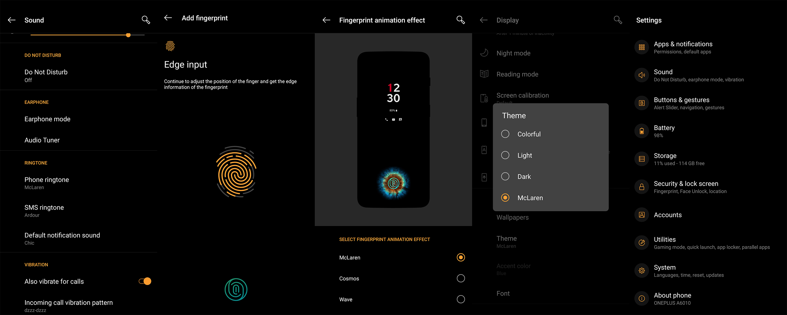
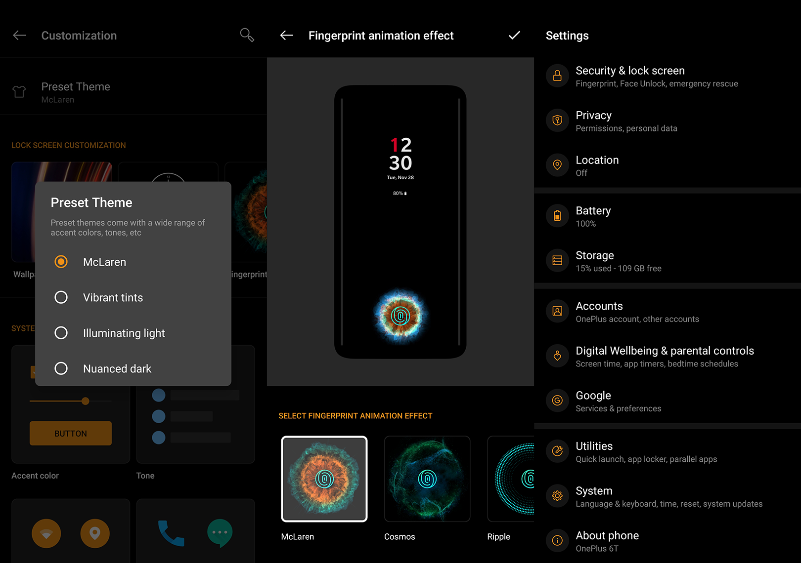
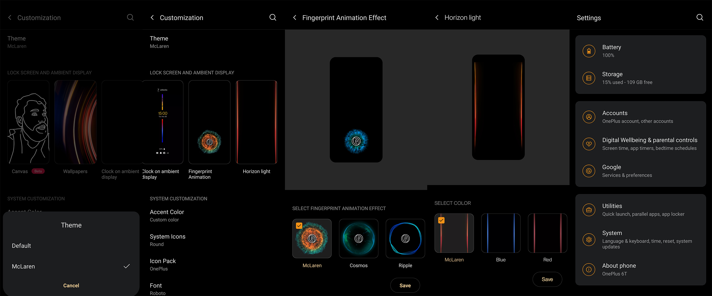

<h1 align="center">OnePlus 6T McLaren Mod</h1>


<div align="center">
  <strong>This mod Is based on PARAM.BIN and PERMANENT. Backup everything first.</div>

<div align="center">
  <h3>
    <a href="https://forum.xda-developers.com/t/param-bin-oneplus6t-mclaren-mod-ar-fingerprint-animation-sound-wallpaper-bootanimation-horizon-light.3880486/">
      XDA
    </a>
  </h3>
</div>


## Mod Features

- Bootanimation
- Sounds
- Theme
- Wallpaper
- Fingerprint Animation
- Horizon Light (Android 11)


## Usage

### Backup:
- param.bin
- op1.img
- op2.img

```sh
adb shell
su
dd if=/dev/block/by-name/param of=/sdcard/param_bak.bin
dd if=/dev/block/by-name/op1 of=/sdcard/op1_bak.img
dd if=/dev/block/by-name/op2 of=/sdcard/op2_bak.img
 ```
### Install McLaren Mod:

```
adb push param.bin /sdcard/param.bin
adb push op1.img /sdcard/op1.img
adb push op1.img /sdcard/op2.img
adb shell
su
dd if=/sdcard/param.bin of=/dev/block/by-name/param
dd if=/sdcard/op1.img of=/dev/block/by-name/op1
dd if=/sdcard/op2.img of=/dev/block/by-name/op2
reboot
```

<details>  
<summary><strong>Screenshots</strong></summary>
<br>

<br>

<br>

<br>
</details>